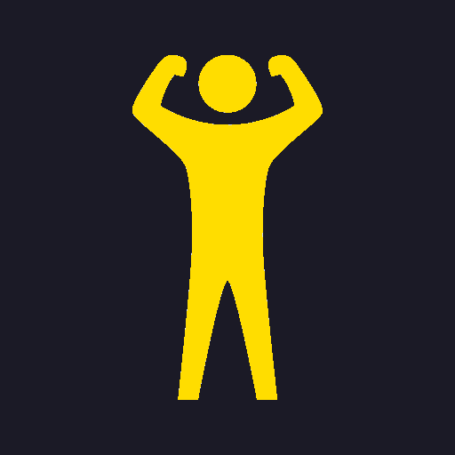

# Champions

https://fytchampion.herokuapp.com/

## Mission

Being healthy is not only great for the body but great for the mind as well. Keep yourself sharp both mentally and physically with Champions.

## Tech Stack

#### Javascript
#### MongoDb
#### Express
#### Passport
#### React
#### Giphy API

## Screenshots

### Login

### Dashboard

### Goals

## Future Updates

### Friends

    Give your specially generated code to friends and they can keep track with you on Champions.
    Compete and have fun.

### Races

    Challenge a friend to a "race". Racing them to the specified goal and earning the precious bragging rights.